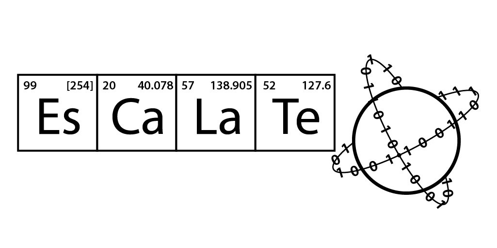

[![Contributors][contributors-shield]][contributors-url]
[![Commits][commits-shield]][commits-url]
[![Last Commit][lastcommit-shield]][lastcommit-url]
[![Issues][issues-shield]][issues-url]
[![MIT License][license-shield]][license-url]

<!-- PROJECT LOGO -->
 

  
  <h1 align="center">ESCALATE v3</h1>
  

   Readme files
     
	<a href="https://github.com/darkreactions/ESCALATE/blob/master/escalate/README.md"><strong>ESCALATE Django Installation Instructions</strong></a>
     
	<a href="https://github.com/darkreactions/ESCALATE/blob/master/escalate/TECHNICAL.md"><strong>ESCALATE v3 Data Model Overview</strong></a>
     
  

  

ESCALATE (Experiment Specification, Capture and Laboratory Automation Technology)—an ontological framework and open-source software package provides an abstraction layer for human- and machine-readable experiment specification, comprehensive and extensible (meta-)data capture, and structured data reporting.

<!-- ******************* Authors ****************** -->

## Authors

* [**Gary Cattabriga**](https://github.com/gcatabr1)
* [**Venkateswaran Shekar**](https://github.com/vshekar)
* [**Nicole Smina**](https://github.com/nsmina914)
* [**Joseph Pannizzo**](https://github.com/jpannizzo)

See also the list of [contributors](https://github.com/darkreactions/ESCALATE/graphs/contributors) who participated in this project.

 

<!-- ******************* License ****************** -->

## License

This project is licensed under the MIT License - see the [LICENSE.txt](LICENSE.txt) file for details

 

<!-- ******************* Acknowledgments ****************** -->

## Acknowledgments
* [DARPA SD2 program](https://www.darpa.mil/program/synergistic-discovery-and-design)
* [Haverford College](https://www.haverford.edu)
* [Lawrence Berkely National Lab](https://www.lbl.gov)
* [Los Alamos National Lab](https://www.lanl.gov)

<!-- MARKDOWN LINKS & IMAGES -->
[contributors-shield]: https://img.shields.io/github/contributors/darkreactions/ESCALATE
[contributors-url]: https://github.com/darkreactions/ESCALATE/graphs/contributors
[lastcommit-shield]: https://img.shields.io/github/last-commit/darkreactions/ESCALATE
[lastcommit-url]: https://github.com/darkreactions/ESCALATE/graphs/commit-activity
[issues-shield]: https://img.shields.io/github/issues/darkreactions/ESCALATE
[issues-url]: https://github.com/darkreactions/ESCALATE/issues
[license-shield]: https://img.shields.io/github/license/darkreactions/ESCALATE
[license-url]: https://github.com/darkreactions/ESCALATE/blob/master/LICENSE
[commits-shield]: https://img.shields.io/github/commit-activity/m/darkreactions/ESCALATE
[commits-url]: https://github.com/darkreactions/ESCALATE/graphs/commit-activity

