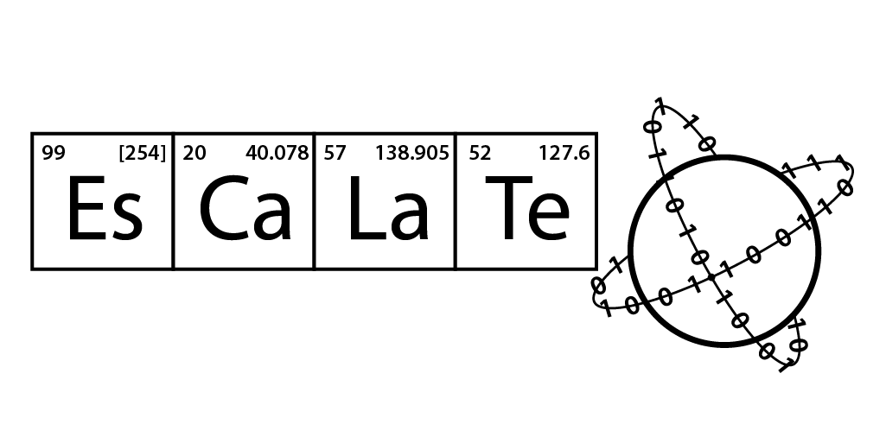

<!-- ESCALATE v3 Data Model -->
<!--
Author: Gary Cattabriga
Date: 01.29.2020
*** I'm using markdown "reference style" links for readability.
*** Reference links are enclosed in brackets [ ] instead of parentheses 
*** See the bottom of this document for the declaration of the reference variables
*** for contributors-url, forks-url, etc. This is an optional, concise syntax you may use.
*** https://www.markdownguide.org/basic-syntax/#reference-style-links
*** used some nice shields from this site:
*** https://shields.io/category/platform-support
-->
<!-- PROJECT LOGO -->
<br />
<p align="center">
  <a href="https://github.com/darkreactions/ESCALATE">
    
  </a>
  <h1 align="center">ESCALATE v3 Data Model</h1>
   <h2 align="center">Technical Document</h2> 
   <p align="center">
    <br />
    <a href="https://github.com/darkreactions/ESCALATE/tree/master/data_model"><strong>Explore the README</strong></a>
    <br />
    <br />
  </p>
</p>

<!-- **************** Table of Contents **************** -->
## Table of Contents

* [Introduction](#introduction)
* [Overview](#overview)
* [Schema Detail](#schemadetail)
* [Functions](#functions)
* [Views](#views)
* [View Models](#viewmodels)
* [Authors](#authors)
* [License](#license)
* [Acknowledgements](#acknowledgements)

<br/>

<!-- ******************* Introduction ****************** -->
<a name="introduction"></a>
## Introduction

These instructions will get you a copy of the database up and running on your local machine (or container) for development and testing purposes. 

<br/>


<!-- ******************* Overview ****************** -->
<a name="overview"></a>
## Overview
Talk about the core entities...

[![Schema Highlevel][schema-highlevel]](https://github.com/darkreactions/ESCALATE/blob/master/data_model/erd_diagrams/escalatev3_schema_highlevel.png)

<br/>

<!-- ******************* Schema Detail ****************** -->
<a name="schemadetail"></a>
## Schema Detail
Discussion on how this stuff all relates together...

[![Schema Detail][schema-detail]](https://github.com/darkreactions/ESCALATE/blob/master/data_model/erd_diagrams/escalate_erd_physicalmodel.pdf)

### Defined Types

```
val_type AS ENUM ('int', 'array_int', 'num', 'array_num', 'text', 'array_text', 'blob_text', 'blob_svg', 'blob_jpg', 'blob_png', 'blob_xrd')

val AS (
	v_type val_type,
	v_text varchar,
	v_text_array varchar[],
	v_int int8,
	v_int_array int8[],
	v_num double precision,
	v_num_array double precision[],
	v_blob bytea)
```
<br/>


### Core Tables (non ETL)

```
actor
actor_pref
calculation
calculation_class
calculation_def
calculation_eval
edocument
edocument_x
escalate_change_log
escalate_version
experiment
experiment_inventory
experiment_udf
files
inventory
material
material_refname
material_refname_def
material_refname_x
material_type
material_type_x
measure
measure_type
measure_x
note
organization
person
status
sys_audit
systemtool
systemtool_type
tag
tag_type
tag_x
udf
udf_def

```
<br/>

### Primary Keys and Constraints

```
CREATE INDEX "ix_sys_audit_relid" ON sys_audit (relid);

CREATE INDEX "ix_sys_audit_action_tstamp_tx_stm" ON sys_audit (action_tstamp_stm);

CREATE INDEX "ix_sys_audit_action" ON sys_audit (action);

ALTER TABLE organization
	ADD CONSTRAINT "pk_organization_organization_uuid" PRIMARY KEY (organization_uuid),
		ADD CONSTRAINT "un_organization" UNIQUE (full_name);
CREATE INDEX "ix_organization_parent_path" ON organization
USING GIST (parent_path);
CREATE INDEX "ix_organization_parent_uuid" ON organization (parent_uuid);
CLUSTER organization
USING "pk_organization_organization_uuid";

ALTER TABLE person
	ADD CONSTRAINT "pk_person_person_uuid" PRIMARY KEY (person_uuid);
CLUSTER person
USING "pk_person_person_uuid";

ALTER TABLE systemtool
	ADD CONSTRAINT "pk_systemtool_systemtool_uuid" PRIMARY KEY (systemtool_uuid),
		ADD CONSTRAINT "un_systemtool" UNIQUE (systemtool_name, systemtool_type_uuid, vendor_organization_uuid, ver);
CLUSTER systemtool
USING "pk_systemtool_systemtool_uuid";

ALTER TABLE systemtool_type
	ADD CONSTRAINT "pk_systemtool_systemtool_type_uuid" PRIMARY KEY (systemtool_type_uuid);
CLUSTER systemtool_type
USING "pk_systemtool_systemtool_type_uuid";

ALTER TABLE actor
	ADD CONSTRAINT "pk_actor_uuid" PRIMARY KEY (actor_uuid);
CREATE UNIQUE INDEX "un_actor" ON actor (coalesce(person_uuid, NULL), coalesce(organization_uuid, NULL), coalesce(systemtool_uuid, NULL));
CLUSTER actor
USING "pk_actor_uuid";

ALTER TABLE actor_pref
	ADD CONSTRAINT "pk_actor_pref_uuid" PRIMARY KEY (actor_pref_uuid);
CLUSTER actor_pref
USING "pk_actor_pref_uuid";

ALTER TABLE experiment
	ADD CONSTRAINT "pk_experiment_experiment_uuid" PRIMARY KEY (experiment_uuid);
CREATE INDEX "ix_experiment_parent_path" ON experiment
USING GIST (parent_path);
CREATE INDEX "ix_experiment_parent_uuid" ON experiment (parent_uuid);
CLUSTER experiment
USING "pk_experiment_experiment_uuid";

ALTER TABLE experiment_inventory
	ADD CONSTRAINT "pk_experiment_inventory_uuid" PRIMARY KEY (experiment_inventory_uuid);
CLUSTER experiment_inventory
USING "pk_experiment_inventory_uuid";
ALTER TABLE experiment_udf
	ADD CONSTRAINT "pk_experiment_udf_uuid" PRIMARY KEY (experiment_udf_uuid);
CLUSTER experiment_udf
USING "pk_experiment_udf_uuid";

ALTER TABLE material
	ADD CONSTRAINT "pk_material_material_uuid" PRIMARY KEY (material_uuid);
CREATE INDEX "ix_material_parent_path" ON material
USING GIST (parent_path);
CREATE INDEX "ix_material_parent_uuid" ON material (parent_uuid);
CLUSTER material
USING "pk_material_material_uuid";

ALTER TABLE material_x
	ADD CONSTRAINT "pk_material_x_material_x_uuid" PRIMARY KEY (material_x_uuid),
		ADD CONSTRAINT "un_material_x" UNIQUE (material_x_uuid, material_uuid);
CLUSTER material_x
USING "pk_material_x_material_x_uuid";

ALTER TABLE material_type
	ADD CONSTRAINT "pk_material_type_material_type_uuid" PRIMARY KEY (material_type_uuid);
CLUSTER material_type
USING "pk_material_type_material_type_uuid";

ALTER TABLE material_type_x
	ADD CONSTRAINT "pk_material_type_x_material_type_x_uuid" PRIMARY KEY (material_type_x_uuid),
		ADD CONSTRAINT "un_material_type_x" UNIQUE (material_uuid, material_type_uuid);
CLUSTER material_type_x
USING "pk_material_type_x_material_type_x_uuid";

ALTER TABLE material_refname
	ADD CONSTRAINT "pk_material_refname_material_refname_uuid" PRIMARY KEY (material_refname_uuid),
		ADD CONSTRAINT "un_material_refname" UNIQUE (description, material_refname_def_uuid);
CLUSTER material_refname
USING "pk_material_refname_material_refname_uuid";

ALTER TABLE material_refname_x
	ADD CONSTRAINT "pk_material_refname_x_material_refname_x_uuid" PRIMARY KEY (material_refname_x_uuid),
		ADD CONSTRAINT "un_material_refname_x" UNIQUE (material_uuid, material_refname_uuid);
CLUSTER material_refname_x
USING "pk_material_refname_x_material_refname_x_uuid";

ALTER TABLE material_refname_def
	ADD CONSTRAINT "pk_material_refname_def_material_refname_def_uuid" PRIMARY KEY (material_refname_def_uuid);
CLUSTER material_refname_def
USING "pk_material_refname_def_material_refname_def_uuid";

ALTER TABLE calculation_class
	ADD CONSTRAINT "pk_calculation_class_calculation_class_uuid" PRIMARY KEY (calculation_class_uuid);
CLUSTER calculation_class
USING "pk_calculation_class_calculation_class_uuid";

ALTER TABLE calculation_def
	ADD CONSTRAINT "pk_calculation_calculation_def_uuid" PRIMARY KEY (calculation_def_uuid),
		ADD CONSTRAINT "un_calculation_def" UNIQUE (actor_uuid, short_name, calc_definition);
CLUSTER calculation_def
USING "pk_calculation_calculation_def_uuid";

ALTER TABLE calculation
	ADD CONSTRAINT "pk_calculation_calculation_uuid" PRIMARY KEY (calculation_uuid),
		ADD CONSTRAINT "un_calculation" UNIQUE (calculation_def_uuid, in_val, in_opt_val);
CLUSTER calculation
USING "pk_calculation_calculation_uuid";

ALTER TABLE calculation_eval
	ADD CONSTRAINT "pk_calculation_eval_calculation_eval_id" PRIMARY KEY (calculation_eval_id),
		ADD CONSTRAINT "un_calculation_eval" UNIQUE (calculation_def_uuid, in_val, in_opt_val);
CLUSTER calculation_eval
USING "pk_calculation_eval_calculation_eval_id";

ALTER TABLE inventory
	ADD CONSTRAINT "pk_inventory_inventory_uuid" PRIMARY KEY (inventory_uuid),
		ADD CONSTRAINT "un_inventory" UNIQUE (material_uuid, actor_uuid, create_date);
CLUSTER inventory
USING "pk_inventory_inventory_uuid";

ALTER TABLE measure
	ADD CONSTRAINT "pk_measure_measure_uuid" PRIMARY KEY (measure_uuid),
		ADD CONSTRAINT "un_measure" UNIQUE (measure_uuid);
CLUSTER measure
USING "pk_measure_measure_uuid";

ALTER TABLE measure_x
	ADD CONSTRAINT "pk_measure_x_measure_x_uuid" PRIMARY KEY (measure_x_uuid),
		ADD CONSTRAINT "un_measure_x" UNIQUE (ref_measure_uuid, measure_uuid);
CLUSTER measure_x
USING "pk_measure_x_measure_x_uuid";

ALTER TABLE measure_type
	ADD CONSTRAINT "pk_measure_type_measure_type_uuid" PRIMARY KEY (measure_type_uuid);
CLUSTER measure_type
USING "pk_measure_type_measure_type_uuid";

ALTER TABLE note
	ADD CONSTRAINT "pk_note_note_uuid" PRIMARY KEY (note_uuid);
CLUSTER note
USING "pk_note_note_uuid";

ALTER TABLE note_x
	ADD CONSTRAINT "pk_note_x_note_x_uuid" PRIMARY KEY (note_x_uuid),
		ADD CONSTRAINT "un_note_x" UNIQUE (ref_note_uuid, note_uuid);
CLUSTER note_x
USING "pk_note_x_note_x_uuid";

ALTER TABLE edocument
	ADD CONSTRAINT "pk_edocument_edocument_uuid" PRIMARY KEY (edocument_uuid),
		ADD CONSTRAINT "un_edocument" UNIQUE (edocument_title, edocument_filename, edocument_source);
CLUSTER edocument
USING "pk_edocument_edocument_uuid";

ALTER TABLE edocument_x
	ADD CONSTRAINT "pk_edocument_x_edocument_x_uuid" PRIMARY KEY (edocument_x_uuid),
		ADD CONSTRAINT "un_edocument_x" UNIQUE (ref_edocument_uuid, edocument_uuid);
CLUSTER edocument_x
USING "pk_edocument_x_edocument_x_uuid";

ALTER TABLE tag
	ADD CONSTRAINT "pk_tag_tag_uuid" PRIMARY KEY (tag_uuid),
		ADD CONSTRAINT "un_tag" UNIQUE (display_text);
CLUSTER tag
USING "pk_tag_tag_uuid";

ALTER TABLE tag_x
	ADD CONSTRAINT "pk_tag_x_tag_x_uuid" PRIMARY KEY (tag_x_uuid),
		ADD CONSTRAINT "un_tag_x" UNIQUE (ref_tag_uuid, tag_uuid);
CLUSTER tag_x
USING "pk_tag_x_tag_x_uuid";

ALTER TABLE tag_type
	ADD CONSTRAINT "pk_tag_tag_type_uuid" PRIMARY KEY (tag_type_uuid),
		ADD CONSTRAINT "un_tag_type" UNIQUE (short_description);
CLUSTER tag_type
USING "pk_tag_tag_type_uuid";

ALTER TABLE udf
	ADD CONSTRAINT "pk_udf_udf_uuid" PRIMARY KEY (udf_uuid);
CLUSTER udf
USING "pk_udf_udf_uuid";

ALTER TABLE udf_x
	ADD CONSTRAINT "pk_udf_x_udf_x_uuid" PRIMARY KEY (udf_x_uuid),
		ADD CONSTRAINT "un_udf_x" UNIQUE (ref_udf_uuid, udf_uuid);
CLUSTER udf_x
USING "pk_udf_x_udf_x_uuid";

ALTER TABLE udf_def
	ADD CONSTRAINT "pk_udf_udf_def_uuid" PRIMARY KEY (udf_def_uuid),
		ADD CONSTRAINT "un_udf_def" UNIQUE (description);
CLUSTER udf_def
USING "pk_udf_udf_def_uuid";

ALTER TABLE status
	ADD CONSTRAINT "pk_status_status_uuid" PRIMARY KEY (status_uuid);
CLUSTER status
USING "pk_status_status_uuid";
```


<br/>

<!-- ******************* Functions ****************** -->
<a name="functions"></a>
## Functions
List of callable and trigger functions (see SQL code for details):

```
trigger_set_timestamp()
if_modified_func()
audit_table(target_table regclass, audit_rows boolean, audit_query_text boolean, ignored_cols text[]) RETURNS void
audit_table(target_table regclass, audit_rows boolean, audit_query_text boolean) RETURNS void
read_file_utf8(path CHARACTER VARYING) RETURNS TEXT
read_file(path CHARACTER VARYING) RETURNS TEXT
isdate ( txt VARCHAR ) RETURNS BOOLEAN
read_dirfiles ( PATH CHARACTER VARYING ) RETURNS BOOLEAN
get_material_uuid_bystatus (p_status_array varchar[], p_null_bool boolean)
   RETURNS TABLE (
		material_uuid uuid,
		material_description varchar)
get_material_nameref_bystatus (p_status_array varchar[], p_null_bool boolean)
   RETURNS TABLE (
       material_uuid uuid,
		material_refname varchar,
		material_refname_def varchar)
get_material_bydescr_bystatus (p_descr varchar, p_status_array VARCHAR[], p_null_bool BOOLEAN)
   RETURNS TABLE (
      material_uuid uuid,
		material_description varchar,
		material_refname_uuid uuid,
		material_refname_description VARCHAR,
		material_refname_def varchar)
get_material_type (p_material_uuid uuid) RETURNS varchar[]
get_actor ()
   RETURNS TABLE (
       actor_uuid uuid,
		organization_uuid int8,
		person_uuid int8,
		systemtool_uuid int8,
		actor_description varchar,
		actor_status varchar,
		notetext varchar,
		org_description varchar,
		person_lastfirst varchar,
		systemtool_name varchar,
		systemtool_version varchar)
get_calculation_def (p_descr VARCHAR[])
   RETURNS TABLE (
		calculation_def_uuid uuid,
		short_name varchar,
		systemtool_name varchar,
		calc_definition varchar,
		description varchar,
		in_type val_type,
		out_type val_type,
		systemtool_version varchar)
get_calculation (p_material_refname varchar, p_descr VARCHAR[] = null)
   RETURNS TABLE (calculation_uuid uuid) 
get_val (p_in val) returns text
get_chemaxon_directory ( p_systemtool_uuid uuid, p_actor_uuid uuid ) RETURNS TEXT
get_chemaxon_version ( p_systemtool_uuid uuid, p_actor_uuid uuid ) RETURNS TEXT
run_descriptor (p_descriptor_def_uuid uuid, p_alias_name varchar, p_command_opt varchar, p_actor_uuid uuid) RETURNS BOOLEAN
load_mol_images ( p_systemtool_uuid uuid, p_actor_uuid uuid ) RETURNS bool
get_charge_count ( p_mol_smiles varchar ) RETURNS int
math_op (p_in_num numeric, p_op text, p_in_opt_num numeric default null) returns numeric
upsert_organization() RETURNS TRIGGER
upsert_person() RETURNS TRIGGER
upsert_systemtool() RETURNS TRIGGER
upsert_systemtool_type () RETURNS TRIGGER
upsert_actor () RETURNS TRIGGER
upsert_tag_type () RETURNS TRIGGER
upsert_tag () RETURNS TRIGGER
upsert_tag_x () RETURNS TRIGGER
upsert_udf_def () RETURNS TRIGGER
upsert_status () RETURNS TRIGGER
upsert_material_type () RETURNS TRIGGER
upsert_material_refname_def () RETURNS TRIGGER
upsert_note () RETURNS TRIGGER  -- this is imcomplete re: edocument

```

<br/>

<!-- ******************* Views ****************** -->
<a name="views"></a>
## Views
Below are a list of the views with high-level description, followed by column names returned by view. Views are named using the following structure: 

### Available Views

```
sys_audit_tableslist
vw_actor
vw_actor_pref
vw_calculation
vw_calculation_def
vw_edocument
vw_experiment_measure_calculation
vw_experiment_measure_calculation_json
vw_inventory
vw_inventory_material
vw_systemtool
vw_material
vw_material_calculation_json
vw_material_calculation_raw
vw_material_raw
vw_material_refname_def
vw_material_type
vw_note
vw_organization
vw_person
vw_status
vw_systemtool_type
vw_tag
vw_tag_x
vw_tag_type
vw_udf_def

```
<br/>


Views provide full **CRUD/Restful API** or minimally **Read/Get** functionality<br/>
```
(C)reate/Post, (R)ead/Get, (U)pdate/Put, (D)elete/Delete
```
<br/>
Each view is described below with the following information:<br/>
__view name__, if it is fully `CRUD` or only `R`, <br/>
*associated upsert trigger function*<br/>
followed by the returned columns;<br/>
columns required are denoted with an `r` (required on insert, not updatable), <br/>
columns visible in forms are denoted with a `v`,<br/>
columns updatable are denoted with a `u`<br/>
Examples<br/><br/>


__vw_actor__`CRUD`<br/>
*upsert\_actor ()*
> actor\_uuid (v) <br/>
> organization\_uuid (v u) <br/>
> person\_uuid (v u) <br/>
> systemtool\_uuid (v u) <br/>
> actor\_description (v u) <br/>
> actor\_status\_uuid (v u)
> actor\_status\_description (v) <br/>
> actor\_add\_date (v) <br/>
> actor\_mod\_date (v) <br/>
> org\_full\_name (v) <br/>
> org\_short\_name (v) <br/>
> person\_last\_name (v) <br/>
> person\_first\_name (v) <br/>
> person\_last\_first (v) <br/>
> person\_org (v) <br/>
> systemtool\_name (v) <br/>
> systemtool\_description (v) <br/>
> systemtool\_type (v) <br/>
> systemtool\_vendor (v) <br/>
> systemtool\_model (v) <br/>
> systemtool\_serial (v) <br/>
> systemtool\_version (v) <br/>

`**NOTE: actor will typically have many dependencies (e.g. experiments, workflows, inventory) so deleting may be impractical. In that case do a status change (e.g. inactive)`
`**NOTE: new actor record will be created on person, organization, systemtool insert`
`**NOTE: delete vw_actor will automatically delete all related actor_pref records`

```
-- first create a 'test' person that will become the actor
insert into vw_person (last_name, first_name, middle_name, address1, address2, city, state_province, zip, country, phone, email, title, suffix, organization_uuid) values ('Tester','Lester','Fester','1313 Mockingbird Ln',null,'Munsterville','NY',null,null,null,null,null,null,null);
-- insert 'test' person into actor
insert into vw_actor (person_uuid, actor_description, actor_status_uuid) values ((select person_uuid from vw_person where (last_name = 'Tester' and first_name = 'Lester')), 'Lester the Actor', (select status_uuid from vw_status where description = 'active'));
-- add a note to the actor; with the author being the same actor !! <- note
insert into vw_note (notetext, actor_uuid, ref_note_uuid) values ('test note for Lester the Actor', (select actor_uuid from vw_actor where person_last_name = 'Tester'), (select actor_uuid from vw_actor where person_last_name = 'Tester'));
-- update the 'test' actor with a new description
update vw_actor set actor_description = 'new description for Lester the Actor' where person_uuid = (select person_uuid from vw_person where (last_name = 'Tester' and first_name = 'Lester'));
-- update the 'test' actor with an assigned organization
update vw_actor set organization_uuid = (select organization_uuid from vw_organization where full_name = 'Haverford College') where person_uuid = (select person_uuid from person where (last_name = 'Tester' and first_name = 'Lester'));
-- delete the actor (WILL get an ERROR as there is a dependency to note)
delete from vw_actor where person_uuid = (select person_uuid from vw_person where (last_name = 'Tester' and first_name = 'Lester'));
-- delete the note
delete from vw_note where note_uuid in (select note_uuid from vw_note where actor_uuid = (select actor_uuid from vw_actor where person_last_name = 'Tester'));
-- delete the actor (no other dependencies, so will succeed)
delete from vw_actor where person_uuid = (select person_uuid from vw_person where (last_name = 'Tester' and first_name = 'Lester'));
-- clean up the 'test' person
delete from vw_person where person_uuid = (select person_uuid from vw_person where (last_name = 'Tester' and first_name = 'Lester'));
```

<br/>

__vw\_actor\_pref__ `CRUD`<br/>
*upsert\_actor_pref ()*
> actor\_pref\_uuid (v) <br/>
> actor\_uuid (r v) <br/>
> pkey (r v u) <br/>
> pvalue (v u) <br/> 
> add\_date (v) <br/> 
> mod\_date (v) <br/>

```
insert into vw_actor_pref (actor_uuid, pkey, pvalue) values ((select actor_uuid from vw_actor where person_last_name = 'Tester'), 'test_key', 'test_value');
update vw_actor_pref set pvalue = 'new_new_test_value' where actor_pref_uuid = (select actor_pref_uuid from vw_actor_pref where actor_uuid = (select actor_uuid from vw_actor where actor_description = 'Lester Fester Tester') and pkey = 'test_key');
delete from vw_actor_pref where actor_pref_uuid = (select actor_pref_uuid from vw_actor_pref where actor_uuid = (select actor_uuid from vw_actor where actor_description = 'Lester Fester Tester'));

```


<br/>

__vw\_organization__ `CRUD`<br/>
*upsert\_organization ()*
> organization\_uuid (v) <br/>
> description (v u) <br/>
> full\_name (r v) <br/>
> short_name (v u) <br/> 
> address1 (v u) <br/>
> address2 (v u) <br/>
> city (v u) <br/>
> state\_province (v u) <br/> 
> zip (v u) <br/> 
> country (v u) <br/> 
> website\_url (v u) <br/> 
> phone (v u) <br/> 
> parent\_uuid (v u) <br/> 
> parent\_org\_full\_name (v) <br/> 
> add\_date (v) <br/> 
> mod\_date (v) <br/>

```
-- insert new record
insert into vw_organization (description, full_name, short_name, address1, address2, city, state_province, zip, country, website_url, phone, parent_uuid) values ('some description here','IBM','IBM','1001 IBM Lane',null,'Some City','NY',null,null,null,null,null);
-- update the description, city and zip columns
update vw_organization set description = 'some [new] description here', city = 'Some [new] City', zip = '00000' where full_name = 'IBM';
-- update with a parent organization
update vw_organization set parent_uuid =  (select organization_uuid from organization where organization.full_name = 'Haverford College') where full_name = 'IBM';
-- delete the record (assumes no dependent, referential records); any notes attached to this record are automatically deleted
delete from vw_organization where full_name = 'IBM';
```


<br/>

__vw\_person__ `CRUD`<br/>
*upsert\_person ()*
> person\_uuid (v) <br/>
> first\_name (v u) <br/>
> last\_name (r v) <br/>
> middle\_name (v u) <br/> 
> address1 (v u) <br/>
> address2 (v u) <br/>
> city (v u) <br/>
> state\_province (v u) <br/> 
> zip (v u) <br/> 
> country (v u) <br/> 
> phone (v u) <br/> 
> email (v u) <br/> 
> title (v u) <br/> 
> suffix (v u) <br/> 
> organization\_uuid (v u) <br/> 
> organization\_full\_name (v) <br/> 
> add\_date (v) <br/> 
> mod\_date (v) <br/>

```
-- insert new person record; also adds actor record related to this person
insert into vw_person (last_name, first_name, middle_name, address1, address2, city, state_province, zip, country, phone, email, title, suffix, organization_uuid) values ('Tester','Lester','Fester','1313 Mockingbird Ln',null,'Munsterville','NY',null,null,null,null,null,null,null);
-- update title, city, zip and email columns
update vw_person set title = 'Mr', city = 'Some [new] City', zip = '99999', email = 'TesterL@scarythings.xxx' where person_uuid = (select person_uuid from person where (last_name = 'Tester' and first_name = 'Lester'));
-- update associated organization
update vw_person set organization_uuid =  (select organization_uuid from organization where organization.full_name = 'Haverford College') where (last_name = 'Tester' and first_name = 'Lester');
-- delete record; any notes attached to this record are automatically deleted - note that actor must be deleted first
delete from vw_actor where person_uuid = (select person_uuid from vw_person where (last_name = 'Tester' and first_name = 'Lester'));
delete from vw_person where person_uuid = (select person_uuid from person where (last_name = 'Tester' and first_name = 'Lester'));
```
<br/>

__vw\_systemtool__`CRUD`<br/>
*upsert\_systemtool ()*
> systemtool\_uuid (v) <br/>
> systemtool\_name (r v u) <br/>
> description (v u) <br/>
> systemtool\_type\_uuid (v u)
> systemtool\_type\_description (v)
> vendor\_organization\_uuid (v u) <br/> 
> organization\_fullname (v) <br/>
> model (v u) <br/>
> serial (v u) <br/>
> ver (r v u) <br/> 
> add\_date (v) <br/> 
> mod\_date (v) <br/>

```
-- insert new systemtool; note, ver[sion] is required
insert into vw_systemtool (systemtool_name, description, systemtool_type_uuid, vendor_organization_uuid, model, serial, ver) values ('MRROBOT', 'MR Robot to you',(select systemtool_type_uuid from vw_systemtool_type where description = 'API'),(select organization_uuid from vw_organization where full_name = 'ChemAxon'),'super duper', null, '1.0');
-- update serial column
update vw_systemtool set serial = 'ABC-1234' where systemtool_uuid = 
 (select systemtool_uuid from vw_systemtool where (systemtool_name = 'MRROBOT'));
-- *** update record with new version, but forced to insert a copy with new ver[sion] and create a new actor ***
update vw_systemtool set ver = '1.1' where systemtool_uuid = 
 (select systemtool_uuid from vw_systemtool where (systemtool_name = 'MRROBOT'));
-- delete [latest] version = 1.1; any notes attached to this record are automatically deleted - note that actor must be deleted first
delete from actor where systemtool_uuid = (select systemtool_uuid from vw_systemtool where systemtool_name = 'MRROBOT' and ver = '1.1');
delete from vw_systemtool where systemtool_uuid = (select systemtool_uuid from vw_systemtool where systemtool_name = 'MRROBOT' and ver = '1.1');
-- delete version = 1.0; any notes attached to this record are automatically deleted - note that actor must be deleted first
delete from actor where systemtool_uuid = (select systemtool_uuid from vw_systemtool where systemtool_name = 'MRROBOT' and ver = '1.1');
delete from vw_systemtool where systemtool_uuid = (select systemtool_uuid from vw_systemtool where systemtool_name = 'MRROBOT' and ver = '1.0');
```


<br/>

__vw\_systemtool_type__`CRUD`<br/>
*upsert\_systemtool\_type ()*
> systemtool\_type\_uuid (v) <br/>
> description (v u) <br/>
> add\_date (v) <br/> 
> mod\_date (v) <br/>

```
-- insert new systemtool_type record
insert into vw_systemtool_type (description) values ('TEST Systemtool Type');
-- update systemtool_type
update vw_systemtool_type set description = 'TEST Systemtool Type w/ extra features';
-- delete systemtool_type; any notes attached to this record are automatically deleted
delete from vw_systemtool_type where systemtool_type_uuid = (select systemtool_type_uuid from vw_systemtool_type where (description = 'TEST Systemtool Type'));
```
<br/>


__vw\_tag__`CRUD`<br/>
*upsert\_tag ()*
> tag\_uuid (v) <br/>
> display_text (r v u) <br/>
> description (v u) <br/>
> actor\_uuid (v u) <br/>
> actor\_description (v) <br/>
> add\_date (v) <br/> 
> mod\_date (v) <br/>
> tag\_type\_uuid (v u) <br/>
> tag\_type\_short\_descr (v) <br/>
> tag\_type\_description (v) <br/>

```
-- insert new tag
 insert into vw_tag (display_text, description, tag_type_uuid, actor_uuid) values ('invalid', 'invalid experiment', null, (select actor_uuid from vw_actor where person_last_name = 'Alves'));
 -- update tag description
 update vw_tag set description = 'invalid experiment with stuff added', tag_type_uuid = (select tag_type_uuid from vw_tag_type where short_description = 'experiment') where tag_uuid = (select tag_uuid from vw_tag where (display_text = 'invalid'));
-- delete tag; any notes attached to this record are automatically deleted	
delete from vw_tag where tag_uuid in (select tag_uuid from vw_tag where (display_text = 'invalid'));
```

<br/>


__vw\_tag_x__`CRUD`<br/>
*upsert\_tag\_x ()*
> tag\_x\_uuid (v) <br/>
> ref\_tag\_uuid (r)
> tag\_uuid (r) <br/>
> add\_date (v) <br/> 
> mod\_date (v) <br/>

```
-- insert new tag_x (tag_uuid, ref_tag_uuid) that ties tag to table record 
 insert into vw_tag_x (tag_uuid, ref_tag_uuid) values ((select tag_uuid from vw_tag where (display_text = 'invalid')), (select actor_uuid from vw_actor where person_last_name = 'Alves') );
 -- delete tag_x
 delete from vw_tag_x where tag_uuid = (select tag_uuid from vw_tag where (display_text = 'invalid') and ref_tag_uuid = (select actor_uuid from vw_actor where person_last_name = 'Alves') );
```

<br/>


__vw\_tag_type__`CRUD`<br/>
*upsert\_tag\_type ()*
> tag\_type\_uuid (v) <br/>
> short_description (r u) <br/>
> description (v u) <br/>
> add\_date (v) <br/> 
> mod\_date (v) <br/>

```
-- insert tag_type
insert into vw_tag_type (short_description, description) values ('TESTDEV', 'tags for development cycle phase');
-- update description column
update vw_tag_type set description = 'tags used to help identify development cycle phase; e.g. SPEC, TEST, DEV' where tag_type_uuid = (select tag_type_uuid from vw_tag_type where (short_description = 'TESTDEV'));
-- update short_description column
update vw_tag_type set short_description = 'TESTDEV1', description = 'tags used to help identify development cycle phase; e.g. SPEC, TEST, DEV' where tag_type_uuid = (select tag_type_uuid from vw_tag_type where (short_description = 'TESTDEV'));
-- delete tag_type (assumes no dependent, referential records); any notes attached to this record are automatically deleted
 delete from vw_tag_type where tag_type_uuid = (select tag_type_uuid from vw_tag_type where (short_description = 'TESTDEV1'));
```

<br/>


__vw\_udf_def__`CRUD`<br/>
*upsert\_udf\_def ()*
> udf\_def\_uuid (v) <br/>
> description (r v u) <br/>
> valtype (v u) <br/>
> add\_date (v) <br/> 
> mod\_date (v) <br/>

```
-- insert udf_def record with only description
insert into vw_udf_def (description, valtype) values ('user defined 1', null);
-- update valtype column; need to cast to val_type 
update vw_udf_def set valtype = 'text'::val_type where udf_def_uuid = (select udf_def_uuid from vw_udf_def where (description = 'user defined 1'));
-- delete udf_def; any notes attached to this record are automatically deleted
delete from vw_udf_def where udf_def_uuid = (select udf_def_uuid from udf_def where (description = 'user defined 1'));
```

<br/>

__vw\_status__`CRUD`<br/>
*upsert\_status ()*
> status\_uuid (v) <br/>
> description (r v u) <br/>
> add\_date (v) <br/> 
> mod\_date (v) <br/>

```
insert into vw_status (description) values ('testtest');
update vw_status set description = 'testtest status' where status_uuid = (select status_uuid from vw_status where (description = 'testtest'));
-- delete record; any notes attached to this record are automatically deleted
delete from vw_status where status_uuid = (select status_uuid from vw_status where (description = 'testtest status'));
```

<br/>

__vw\_material\_type__`CRUD`<br/>
*upsert\_material\_type ()*
> material\_type\_uuid (v) <br/>
> description (r v u) <br/>
> add\_date (v) <br/> 
> mod\_date (v) <br/>

```
insert into vw_material_type (description) values ('materialtype_test');
-- delete record; any notes attached to this record are automatically deleted
delete from vw_material_type where material_type_uuid = (select material_type_uuid from vw_material_type where (description = 'materialtype_test'));
```

<br/>

__vw\_material\_refname\_def__`CRUD`<br/>
*upsert\_material\_refname\_def ()*
> material\_refname\_def\_uuid (v) <br/>
> description (r v u) <br/>
> add\_date (v) <br/> 
> mod\_date (v) <br/>

```
insert into vw_material_refname_def (description) values ('materialrefnamedef_test');
-- delete record; any notes attached to this record are automatically deleted
delete from vw_material_refname_def where material_refname_def_uuid = (select material_refname_def_uuid from vw_material_refname_def where (description = 'materialrefnamedef_test'));
```

<br/>


__vw\_note__`CRUD`<br/>
*upsert\_material\_refname\_def ()*
> note\_uuid (v) <br/>
> notetext (v u) <br/>
> add\_date (v) <br/> 
> mod\_date (v) <br/>
> actor\_uuid (v u) <br/>
> actor\_description (v) <br/>
> note\_x\_uuid <br/>
> ref\_note\_uuid (r)

```
insert into vw_note (notetext, actor_uuid, ref_note_uuid) values ('test note', (select actor_uuid from vw_actor where person_last_name = 'Cattabriga'), (select actor_uuid from vw_actor where person_last_name = 'Cattabriga'));
-- no insert, ref_note_uuid missing
insert into vw_note (notetext, actor_uuid) values ('test note', (select actor_uuid from vw_actor where person_last_name = 'Cattabriga'));
update vw_note set notetext = 'test note with additional text...' where note_uuid = (select note_uuid from vw_note where (notetext = 'test note'));
delete from vw_note where note_uuid = (select note_uuid from vw_note where (notetext = 'test note with additional text...'));
 --- delete all notes associated with a given entity
insert into vw_note (notetext, actor_uuid, ref_note_uuid) values ('test note 1', (select actor_uuid from vw_actor where person_last_name = 'Alves'), (select actor_uuid from vw_actor where person_last_name = 'Alves'));
insert into vw_note (notetext, actor_uuid, ref_note_uuid) values ('test note 2', (select actor_uuid from vw_actor where person_last_name = 'Alves'), (select actor_uuid from vw_actor where person_last_name = 'Alves'));
insert into vw_note (notetext, actor_uuid, ref_note_uuid) values ('test note 3', (select actor_uuid from vw_actor where person_last_name = 'Alves'), (select actor_uuid from vw_actor where person_last_name = 'Alves'));
delete from vw_note where note_uuid in (select note_uuid from vw_note where actor_uuid = (select actor_uuid from vw_actor where person_last_name = 'Alves'));
```
<br/>


<!-- UPDATE views!! 

```
vw_[filter]_[table1]_[table2]_[tablen]
```
where *filter* indicates a 'where/having clause' applied and the [table] entities are listed in order of preponderance.

e.g. __vw\_latest\_systemtool__ returns records from the **systemtool** table with a 'filter' or where clause selecting only 'active' status records. 
<br/><br/>

-->

<br/>

__vw\_calculation__`R`<br/>
> calculation_uuid (v) <br/> 
> in_val (v) <br/> 
> in_val_type (v) <br/> 
> in_val_value (v) <br/> 
> in_val_unit (v) <br/>
> in_val_edocument_uuid (v) <br/> 
> in_opt_val (v) <br/> 
> in_opt_val_type (v) <br/> 
> in_opt_val_value (v) <br/>
> in_opt_val_unit (v) <br/> 
> in_opt_val_edocument_uuid (v) <br/> 
> out_val (v) <br/> 
> out_val_type (v) <br/> 
> out_val_value (v) <br/> 
> out_val_unit (v) <br/> 
> out_val_edocument_uuid (v) <br/> 
> calculation_alias_name (v) <br/> 
> create_date (v) <br/> 
> calculation_status_uuid (v)
> calulation_status_description (v) <br/> 
> actor_descr (v) <br/> 
> calculation_def_uuid (v) <br/> 
> short_name (v) <br/>
> calc_definition (v) <br/> 
> description (v) <br/> 
> in_type (v) <br/> 
> out_type (v) <br/> 
> systemtool_uuid (v) <br/> 
> systemtool_name (v) <br/> 
> systemtool_type_description (v) <br/> 
> systemtool_vendor_organization (v) <br/> 
> systemtool_version (v) <br/> 
> actor_uuid (v) <br/> 
> actor_description (v) <br/>
> add_date (v) <br/>
> mod_date (v) <br/>

<br/>

__vw\_calculation\_def__`R`<br/>
> calculation_def_uuid (v) <br/> 
> short_name (v) <br/> 
> calc_definition (v) <br/>
> description (v) <br/>
> in_type (v) <br/>
> out_type (v) <br/>
> systemtool_uuid (v) <br/>
> systemtool_name (v) <br/>
> systemtool_type_description (v) <br/>
> systemtool_vendor_organization (v) <br/>
> systemtool_version (v) <br/>
> actor_uuid (v) <br/>
> actor_description (v) <br/>
> calculation_def_status_uuid (v) <br/>
> calculation_def_status_description (v) <br/>
> add_date (v) <br/>
> mod_date (v) <br/>


<br/>


__vw\_edocument__`R`<br/>
> edocument_uuid (v) <br/> 
> edocument_title (v) <br/> 
> edocument_description (v) <br/> 
> edocument_filename (v) <br/>
> edocument_source (v) <br/> 
> edocument_type (v) <br/> 
> edocument (v) <br/> 
> actor_uuid (v) <br/> 
> actor_description (v) <br/>
> status_uuid (v) <br/>
> status_description (v) <br/>
> add_date (v) <br/>
> mod_date (v) <br/>


<br/>


__vw\_inventory__`R`<br/>
> inventory_uuid (v) <br/>
> inventory_description (v) <br/>
> part_no (v) <br/>
> onhand_amt (v) <br/>
> unit (v) <br/>
> create_date (v) <br/>
> expiration_date (v) <br/>
> inventory_location (v) <br/>
> status_uuid (v) <br/>
> status_description (v) <br/>
> material_uuid (v) <br/>
> material_description (v) <br/>
> actor_uuid (v) <br/> 
> actor_description (v) <br/>
> add_date (v) <br/>
> mod_date (v) <br/>

<br/>

__vw\_inventory\_material__`R`<br/>
> inventory_uuid (v) <br/>
> inventory_description (v) <br/>
> inventory_part_no (v) <br/>
> inventory_onhand_amt (v) <br/>
> inventory_unit (v) <br/>
> inventory_create_date (v) <br/>
> inventory_expiration_date (v) <br/>
> inventory_location (v) <br/>
> inventory_status_uuid (v) <br/>
> inventory_status_description (v) <br/>
> actor_uuid (v) <br/>
> actor_description (v) <br/>
> org_full_name (v) <br/>
> material_uuid (v) <br/>
> material_status_description (v) <br/>
> create_date AS material_create_date (v) <br/>
> chemical_name AS material_name (v) <br/>
> abbreviation AS material_abbreviation (v) <br/>
> inchi AS material_inchi (v) <br/>
> inchikey AS material_inchikey (v) <br/>
> molecular_formula AS material_molecular_formula (v) <br/>
> smiles AS material_smiles (v) <br/>


<br/>

__vw\_material__`R`<br/>
> material_uuid (v) <br/>
> material_status_uuid (v) <br/>
> material_status_description (v) <br/>
> create_date (v) <br/>
> Abbreviation (v) <br/>
> Chemical_Name (v) <br/>
> InChI (v) <br/>
> InChIKeyv
> Molecular_Formula (v) <br/>
> SMILES (v) <br/>


<br/>

__vw\_material\_calculation\_raw__`R`<br/>
> material_uuid (v) <br/>
> material_status (v) <br/>
> material_create_date (v) <br/>
> abbreviation (v) <br/>
> chemical_name (v) <br/>
> inchi (v) <br/>
> inchikey (v) <br/>
> molecular_formula (v) <br/>
> smiles (v) <br/>
> calculation_uuid (v) <br/>
> in_val (v) <br/>
> in_val_type (v) <br/>
> in_val_value (v) <br/>
> in_val_unit (v) <br/>
> in_val_edocument_uuid (v) <br/>
> in_opt_val (v) <br/>
> in_opt_val_type (v) <br/>
> in_opt_val_value (v) <br/>
> in_opt_val_unit (v) <br/>
> in_opt_val_edocument_uuid (v) <br/>
> out_val (v) <br/>
> out_val_type (v) <br/>
> out_val_value (v) <br/>
> out_val_unit (v) <br/>
> out_val_edocument_uuid (v) <br/>
> calculation_alias_name (v) <br/>
> calculation_create_date (v) <br/>
> calculation_status_uuid (v) <br/>
> calculation_status_description (v) <br/>
> status (v) <br/>
> actor_descr (v) <br/>
> calculation_def_uuid (v) <br/>
> short_name (v) <br/>
> calc_definition (v) <br/>
> description (v) <br/>
> in_type (v) <br/>
> out_type (v) <br/>
> systemtool_uuid (v) <br/>
> systemtool_name (v) <br/>
> systemtool_type_description (v) <br/>
> systemtool_vendor_organization (v) <br/>
> systemtool_version (v) <br/>
> actor_uuid (v) <br/>
> actor_description (v) <br/>


<br/>

__vw\_material\_raw__`R`<br/>
> material_uuid (v) <br/>
> material_description (v) <br/>
> material_status_uuid (v) <br/>
> material_status_description (v) <br/>
> material_type_description (v) <br/>
> material_refname_def (v) <br/>
> material_refname_description (v) <br/>
> material_refname_def_uuid (v) <br/>
> material_create_date (v) <br/>


<br/>

<!-- ******************* View Models ****************** -->
<a name="viewmodels"></a>
## View Models

### Note View Model
[![Note View Model][note-viewmodel]](https://github.com/darkreactions/ESCALATE/blob/master/data_model/erd_diagrams/note_viewmodel.pdf)

### Tag Manage View Model
[![Tag Manage View Model][tag-manage-viewmodel]](https://github.com/darkreactions/ESCALATE/blob/master/data_model/erd_diagrams/tag_manage_viewmodel.pdf)

### Tag Assign Model
[![Tag Assign View Model][tag-assign-viewmodel]](https://github.com/darkreactions/ESCALATE/blob/master/data_model/erd_diagrams/tag_assign_viewmodel.pdf)

<!-- ******************* Authors ****************** -->
<a name="authors"></a>
## Authors

* **Gary Cattabriga** [ESCALATE](https://github.com/gcatabr1)

See also the list of [contributors](https://github.com/darkreactions/ESCALATE/graphs/contributors) who participated in this project.

<br/>

<!-- ******************* License ****************** -->
<a name="license"></a>
## License

This project is licensed under the MIT License - see the [LICENSE.txt](LICENSE.txt) file for details

<br/>


<!-- ******************* Acknowledgments ****************** -->
<a name="acknowledgements"></a>
## Acknowledgments
* [DARPA SD2 program](https://www.darpa.mil/program/synergistic-discovery-and-design)
* [Haverford College](https://www.haverford.edu)
* [Lawrence Berkely National Lab](https://www.lbl.gov)


<!-- MARKDOWN LINKS & IMAGES -->
[postgresqlinstall-url]: https://www.postgresql.org/download/
[postgresql-logo]: images/postgresql_logo.png
[dockerinstall-url]: https://docs.docker.com/install/
[docker-logo]: images/docker_logo.png
[pgadmininstall-url]: https://www.pgadmin.org/download/
[pgadmin-logo]: images/pgadmin_logo.png
[schema-highlevel]: erd_diagrams/escalatev3_schema_highlevel.png
[schema-detail]: erd_diagrams/escalate_erd_physicalmodel.png
[note-viewmodel]: erd_diagrams/note_viewmodel.png
[tag-manage-viewmodel]: erd_diagrams/tag_manage_viewmodel.png
[tag-assign-viewmodel]: erd_diagrams/tag_assign_viewmodel.png

